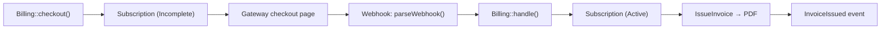

# Overview

Laravel Billing is one package to maintain. Payment gateways are an extension point (a contract),
not separate packages — each app writes a small driver class. The engine owns subscription and
invoice state; your app owns access control, the webhook route, and (optionally) the UI.

## Design principles

- **One package, one repo.** No per-gateway sub-packages. BayarCash, ToyyibPay, Chip, Stripe… each
  app implements the `PaymentGateway` contract. The package never references a real gateway by name.
- **Batteries included.** A first-class `LocalGateway` (no real money) is the default, so a fresh
  app runs the full subscribe → activate → invoice flow immediately.
- **Headless core, optional UI.** Models, services, contract, events, and the manager work with no
  UI. The Livewire + Flux pages are opt-in. See [Billing UI](../03-billing-ui/README.md).
- **Tenancy optional.** The bill target is polymorphic — attach `Billable` to a `User` or a
  `Team`/`Workspace`.
- **Malaysia-friendly invoicing.** MYR default, SST/SSM-aware invoice template, atomic sequential
  numbering — all configurable and neutral by default.

## The moving parts

| Component | Responsibility |
|-----------|----------------|
| `BillingManager` (facade `Billing`) | Resolves gateways, drives checkout, cancel/resume/swap, dispatches webhooks |
| `PaymentGateway` (contract) | The single extension point for real gateways |
| `LocalGateway` | Bundled dev driver — dev checkout page, no real money |
| `PlanRepository` | Resolves plans from config or the database |
| `IssueInvoice` | Allocates a number, computes tax, renders + stores the PDF, fires `InvoiceIssued` |
| `GenerateReceipt` | Renders a receipt PDF on the fly from a paid invoice |
| `WebhookProcessor` | Replay-guards, locates the subscription, transitions status, issues invoices |
| `HasSubscriptions` (trait) | The default `Billable` implementation on your models |

## The subscription lifecycle

1. `Billing::checkout()` creates a pending (`Incomplete`) subscription and delegates to the active
   driver, which returns a `CheckoutIntent` (redirect URL + correlation id).
2. The customer pays on the gateway page. The gateway calls your webhook route.
3. Your route normalises the request with `parseWebhook()` and passes it to `Billing::handle()`.
4. `WebhookProcessor` transitions the subscription to `Active`, calls `IssueInvoice`, and fires the
   matching event.

With the local gateway you can set `BILLING_LOCAL_AUTO=true` to run that whole flow synchronously
(useful for CI, tests, and demos).

## Component ownership

| Lives in the package | Lives in your app |
|----------------------|-------------------|
| Contracts, models, migrations, enums, DTOs, events | The `Billable` model + `use HasSubscriptions` |
| `LocalGateway` (bundled default) | Concrete gateway drivers + their SDKs |
| `IssueInvoice`, `GenerateReceipt`, `PlanRepository`, `BillingManager` | The webhook route + tenancy/env gating |
| Optional Livewire + Flux UI (publishable, overridable) | Enabling/scoping routes, `livewire/flux`, branding |

## Next Steps

- [Domain models](02-domain-models.md)
- [Gateways and webhooks](03-gateways-and-webhooks.md)
