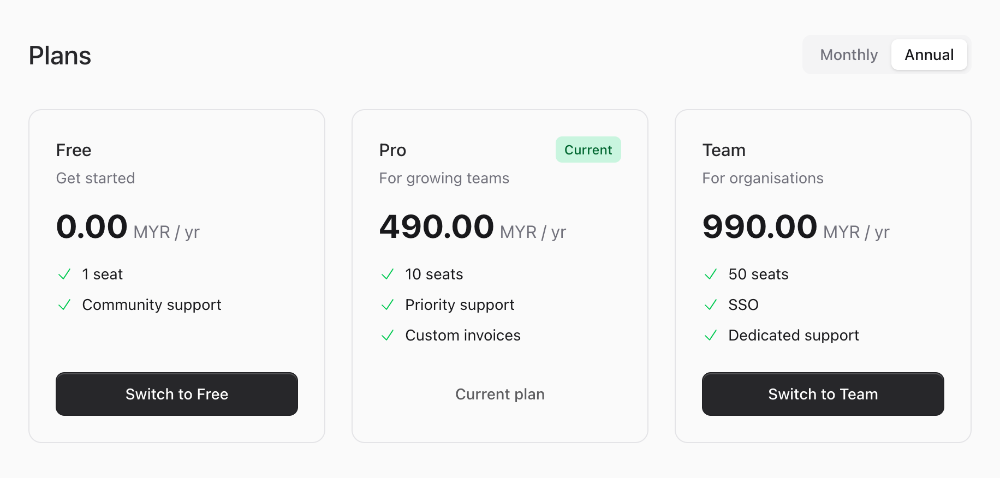
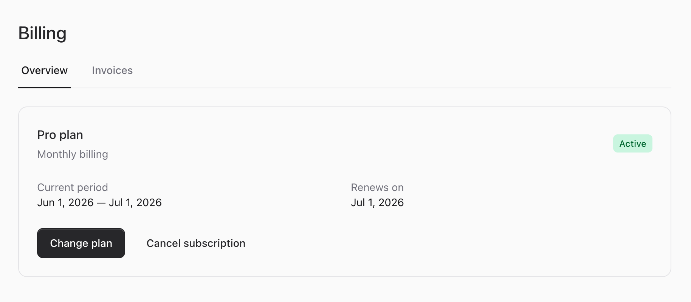
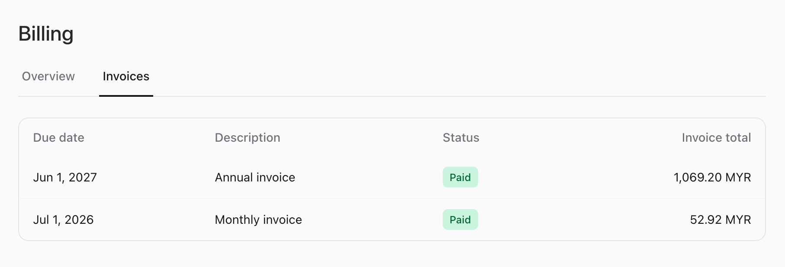

# Overview

The billing UI is three Livewire components rendered with Flux: a plan picker, a billing portal, and
a post-payment receipt card. Together they walk a customer through the entire cycle. The screenshots
below are from the bundled [Testbench workbench](../05-development/01-workbench-preview.md) demo
(Free / Pro / Team plans, SST tax, local gateway).

## 1. Choose a plan

`/billing/plans` lists every active plan with a monthly/annual toggle. The current tier is badged,
and each card has a Subscribe (or Switch) action that starts checkout.

Toggling to annual recomputes every price from each plan's `price_cents['annual']`:

## 2. Pay

Subscribing calls `Billing::checkout()` and redirects to the gateway. With the bundled local
gateway, that is the dev checkout page (no real money) — Approve activates the subscription and
issues an invoice; Decline leaves it `Incomplete`.

A real gateway would redirect to its own hosted payment page instead. See
[Gateways and Webhooks](../02-architecture/03-gateways-and-webhooks.md).

## 3. Manage the subscription

`/billing` opens the portal. The **Overview** tab shows the active plan, status, current period,
renewal date, and Change plan / Cancel actions. Cancelling sets `cancel_at_period_end` (access
continues during the grace period); Resume undoes it.

## 4. Invoices and receipts

The **Invoices** tab lists every invoice for the billable — due date, description, status, and
total. Each row opens a detail panel with the cost breakdown and download links.

Invoices accumulate across periods and intervals:

The invoice and receipt PDFs are covered in
[Invoices and Receipts](04-invoices-and-receipts.md).

## Next Steps

- [Routes and authorization](02-routes-and-authorization.md)
- [Components and customization](03-components.md)
