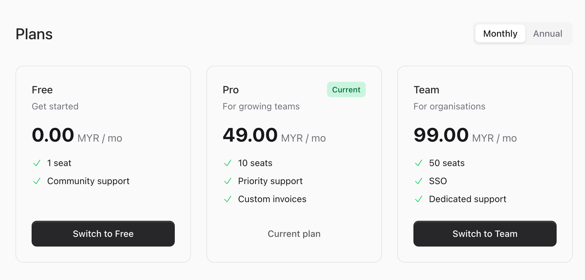
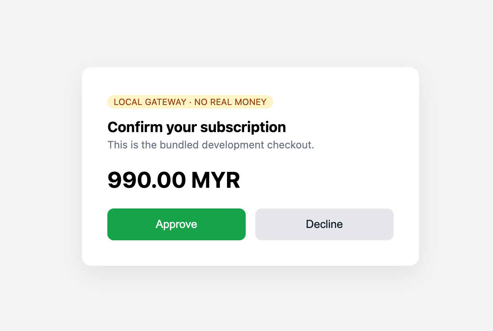
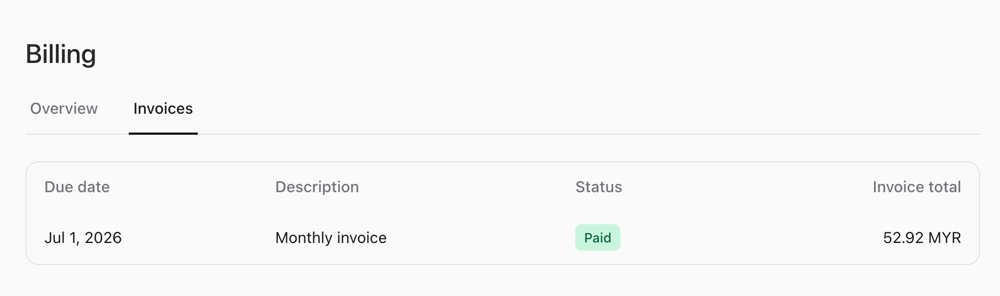

# The Full Billing Cycle

This walkthrough follows one billable from picking a plan to holding a receipt — first as the
customer sees it, then as the code runs it. It uses the bundled local gateway, so it works on a
fresh install with no merchant account.

## As the customer sees it

1. **Choose a plan** at `/billing/plans` and click Subscribe.

   

2. **Pay** on the gateway page. With the local gateway this is the dev checkout — click Approve.

   

3. **Land on the receipt** at `/billing/success`, with download links for the invoice and receipt.

4. **Review anytime** at `/billing` — the active subscription and every invoice.

   

## As the code runs it

### 1. Start checkout

```php
use CleaniqueCoders\LaravelBilling\Enums\PlanInterval;
use CleaniqueCoders\LaravelBilling\Facades\Billing;
use CleaniqueCoders\LaravelBilling\Services\PlanRepository;

$plan   = app(PlanRepository::class)->find('pro');
$intent = Billing::checkout($user, $plan, PlanInterval::Monthly, route('billing.success'));

return redirect()->away($intent->redirectUrl);
```

This creates an `Incomplete` subscription and returns where to send the customer. The `Plans`
Livewire component does exactly this.

### 2. Activation via webhook

When the gateway confirms payment it calls your webhook route, which normalises and dispatches the
event:

```php
$event = Billing::gateway($gateway)->parseWebhook($request);
abort_if($event === null, 401);

Billing::handle($event);
```

`Billing::handle()` transitions the subscription to `Active`, calls `IssueInvoice` (which allocates
`INV-2026-000001`, computes SST, stores the PDF), and fires `SubscriptionActivated` and
`InvoiceIssued`. With `BILLING_LOCAL_AUTO=true`, steps 1–2 happen in a single request.

### 3. The invoice and receipt

The invoice is now downloadable, and a receipt is derived from it on demand:

- Invoice → `route('billing.invoices.download', $invoice->uuid)`
- Receipt → `route('billing.invoices.receipt', $invoice->uuid)`

For a Pro monthly plan at 49.00 MYR with 8% SST, the totals are:

| Line | Amount |
|------|--------|
| Subtotal | 49.00 MYR |
| SST (8%) | 3.92 MYR |
| **Total** | **52.92 MYR** |

See the rendered [sample invoice](../assets/sample-invoice.pdf) and
[sample receipt](../assets/sample-receipt.pdf), and
[Invoices and Receipts](../03-billing-ui/04-invoices-and-receipts.md) for the breakdown.

### 4. Manage the subscription

```php
Billing::cancel($subscription);                 // at period end (grace period)
Billing::resume($subscription);                 // undo a scheduled cancellation
Billing::swap($subscription, $plan, $interval); // change plan/interval
```

## Next Steps

- [Write your own gateway](02-custom-gateway.md)
- [Gateways and webhooks](../02-architecture/03-gateways-and-webhooks.md)
